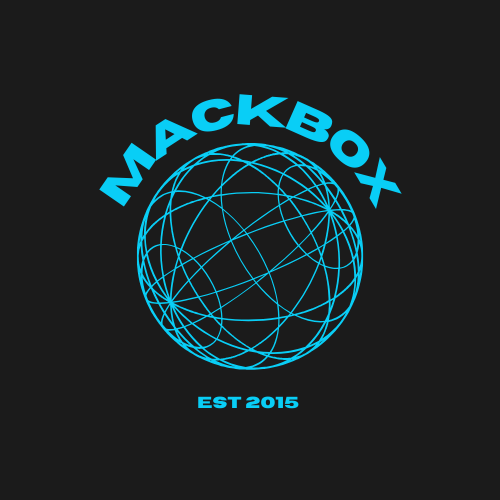
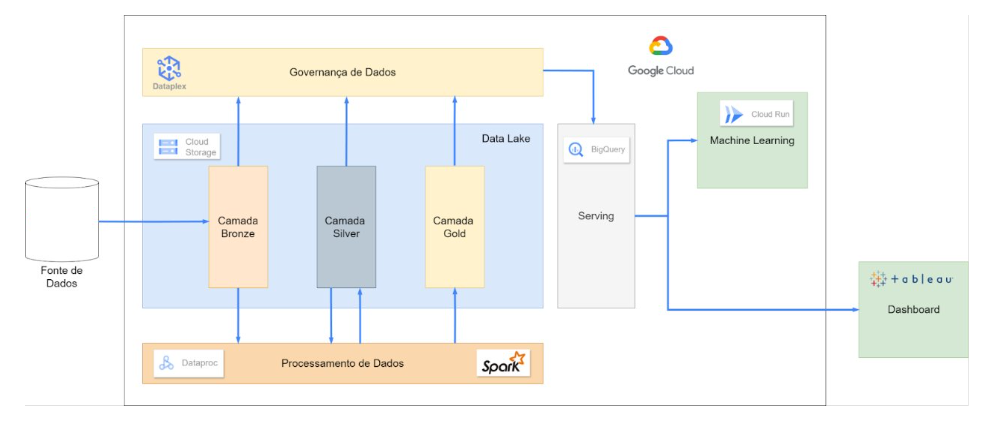
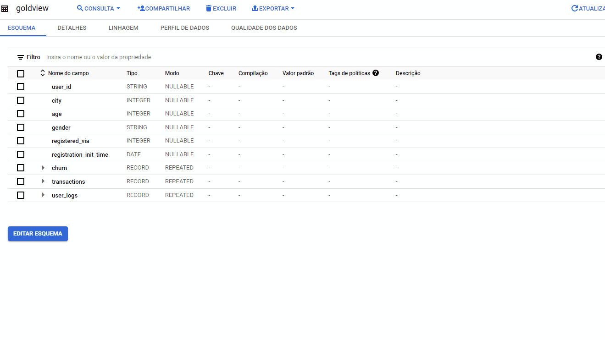
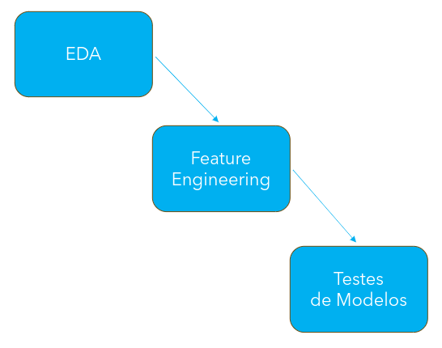
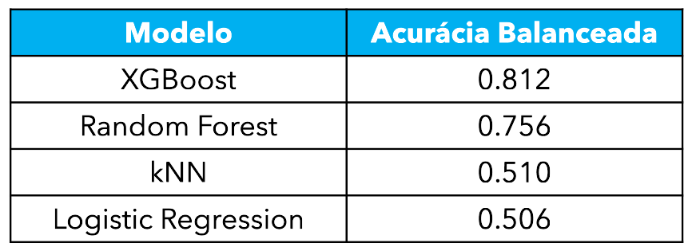
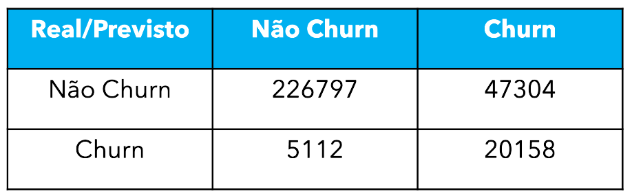
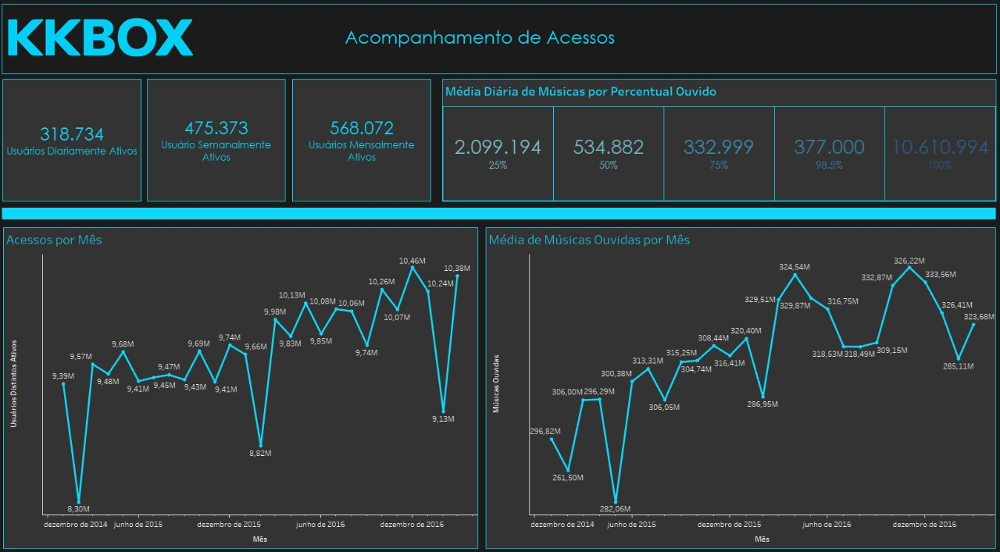

# MackBox - Previsão de Churn

Este projeto foi desenvolvido como parte do programa de Pós-Graduação em Engenharia de Dados ofertada pela Universidade Presbiteriana Mackenzie, formando a avaliação final conjunta da seguintes disciplinas:
- Dados e Analytics nas Organizações
- Data Lakes, Lakehouses e Data Meshes
- Governança de Dados e Metadados
- Hands-On Fundamentos de Dados e Analytics

Nesse projeto, os alunos foram desafiados a criar uma solução de dados completa visando a solução de problemas corporativos de grande impacto nas empresas. Neste projeto, fomos desafiados a criar uma solução de previsão de Churn para uma empresa fictícia produtora de um aplicativo de streaming de músicas.

O projeto foi apresentado em um evento de finalização de semestre, que contou com a participação dos professores e alunos do curso, além de uma banca avaliadora composta por profissionais de grande experiência no mercado de dados.

## Contexto

  

O MackBox é um serviço de streaming de música desenvolvido pela MackBox Inc., empresa sediada no Brasil. Com um repertório de mais de 30 milhões de músicas, o MackBox possui como alvo principalmente o mercado brasileiro e de alguns países da América do Sul, onde já superou a marca de 10 milhões de usuários totais em 10 anos de operação.

Como organização, a missão do MackBox é a de promover a liberdade de expressão de diversas vozes e ajudar artistas a serem ouvidos através de seus produtos e serviços.

Seus valores incluem:
- Audácia: O MackBox acredita na ousadia de propor métodos inovadores em meio a desafios, sem hesitações.
- Curiosidade: Sempre explorar as necessidades dos usuários e tendências de mercado de forma a criar novas e melhores experiências musicais, inspirando pessoas a mostrarem sua criatividade.
- Diversidade: A diversidade da música pode tornar o mundo mais colorido e inspirar mais criatividade. 

## Apresentação do Problema
Atualmente, para reter os seus clientes, a MackBox utiliza algumas técnicas de Análise de Sobrevivência para estimar o tempo em que o usuário pode deixar a plataforma, identificando e agindo em clientes para impedir sua perda antes que a sua descontinuidade com o serviço, geralmente denominado de Churn, aconteça.

Entretanto, a empresa pretende modernizar este método visando alcançar uma melhor precisão, e com a grande disponibilidade de dados a respeito dos seus usuários e de seus comportamentos, aproveitar-se do seu potencial para identificar o fenômeno de churn de maneira mais assertiva parece ser uma alternativa natural.

## Arquitetura da Solução
Para montar uma solução que atenda os requisitos descritos na seção anterior, diversas ferramentas precisam ser conectadas de uma maneira lógica de forma a montar um produto único capaz de receber os dados fornecidos pelo problema, e gerar no fim as devidas soluções de dados. A arquitetura proposta para este projeto se encontra apresentada na imagem abaixo.

Uma descrição breve de cada componente da arquitetura é apresentada nas seções seguintes.

## Fonte dos Dados
Os dados obtidos para este trabalho foram extraídos de uma competição realizada em 2018, promovida pela KKBox, uma empresa real de streaming de músicas, situada na Tailândia. Os dados originais são compostos de algumas tabelas, especificadas a seguir.
- Membros: Informações sobre os usuários do serviço, como idade, gênero, cidade, entre outros.
- Transações: O conjunto de dados de transações apresenta todo o histórico de transações financeiras realizadas pelo usuário referente a aplicação, que basicamente consistem em renovações e cancelamentos de suas assinaturas.
- Registro de Usuários: contém o histórico de uso da aplicação por cada usuário, onde cada amostra corresponde a um dia em que o usuário utilizou a aplicação, para o qual algumas informações como o total de segundos ouvido e o número de músicas distinstas reproduzidas é apresentado.
- Treino e Teste: Conjuntos de dados contendo usuários para treinamento e teste do modelo. 
    - Para o treino, usuários que tiveram seus planos expirados nos meses de Fevereiro e Março de 2017 são fornecidos, junto com o seu comportamento conhecido de churn.
    - Para o teste, usuários que terão seus planos expirados em Abril de 2017 são fornecidos.

## Data Lake e Processamento dos Dados
Para o devido armazenamento dos dados, tanto em formato bruto, como os dados processados, um Data Lake foi criado. 
Um Data Lake consiste basicamente em um repositório central de dados, capaz de armazenar dados dos mais diversos formatos a um baixo custo. A partir dos dados armazenados no mesmo, versões mais polidas dos dados podem ser criadas para alimentar a construção de diversas aplicações de dados, desde análise ad hoc até modelos de inteligência artificial.

O Data Lake proposto neste trabalho seguiu os princípios da Arquitetura de Medalhão, que propõe a divisão do armazenamento em algumas camadas, cada qual contendo o dado em uma determinada fase do seu ciclo de processamento. A definição da quantidade e tipo de dado armazenado em cada camada, bem como a nomenclatura adotada, entretanto, varia consideravelmente na prática. Para este trabalho, as seguintes camadas foram definidas:

- Bronze: Camada contendo os dados em formato bruto, exatamente como extraídos da sua origem, sem nenhum tipo de transformação.
- Silver: Camada contendo as mesmas tabelas da Camada Bronze, porém em um formato mais processado, o que pode envolver a padronização do nome das colunas, remoção de dados inválidos ou nulos, conversão do formato das colunas para tipos adequados e outras operações. Além disso, o formato de salvamento dos dados pode ser substituído para um formato de arquivo mais performático para aplicações de dados.
- Gold: Camada contendo os dados oriundos da Camada Silver, mas com aplicações de técnicas de modelagem de dados para prover os dados em um formato adequado para as aplicações, garantindo facilidade de uso e performance de leitura. São os dados armazenados nesta camada que são efetivamente utilizados pelas aplicações de dados conectadas ao Data Lake.

Cada uma destas camadas foi armazenada em um bucket do Google Cloud Storage, solução de armazenamento de objetos do Google Cloud. O Armazenamento de Objetos consiste em um tipo de solução de armazenamento que permite o registro de arquivos de vários formatos, e a sua manutenção por grandes períodos de tempo a um baixo custo, sendo a principal ferramenta utilizada hoje em dia para armazenamento de dados em soluções de Data Lake.

Para promover todas as transformações de dados apresentadas ao longo do Data Lake, é necessário empregar um motor de processamento dos dados. Neste projeto, esta função foi cumprida pelo Dataproc, um serviço de gerenciamento de clusters Hadoop ofertado pelo Google, através do qual jobs Spark, escritos em Python, foram executados para processar os dados, que apresentavam um tamanho razoável.

## Governança de Dados
A Governança de Dados consiste em um conjunto de princípios para gerenciar os recursos de dados de uma empresa ao longo do seu ciclo de vida, definindo padrões sobre a forma como os dados são ingeridos, armazenados, processados e descartados, de forma a garantir que os mesmos sejam seguros e precisos e altamente disponíveis para sua utilização pelos diversos consumidores dentro de uma organização. Além disso, a Governança de Dados também é responsável por garantir a segurança e o controle de acesso aos dados, e garantir a conformidade de uma organização com diversos padrões legais externos definidos por agências governamentais e outras organizações.

Para este trabalho, os princípios da Governança de Dados foram aplicados visando dois objetivos principais:
- Promover a qualidade dos dados, garantindo a aprovação dos mesmos perante a testes que garantem um fornecimento de informações corretos para o usuário final.
- Garantir uma maior acessibilidade dos dados pelos usuários, através da documentação e catalogação dos diferentes conjuntos de dados existentes no Data Lake e o seus formatos, além da extração de características estatísticas sobre as colunas de cada tabela de forma a fornecer um perfil dos dados que podem auxiliar os usuários finais na análise dos dados.

Para atingir estes objetivos, o Dataplex foi utilizado, que consiste em uma plataforma de Governança de Dados oferecida pelo Google Cloud, oferecendo uma gama de funcionalidades, que envolvem desde aplicação de testes de qualidade, passando por controles de acesso até criação de glossários, e com uma alto nível de integração com outras ferramentas do ecossistema Google Cloud, especialmente com o BigQuery, onde os metadados de cada tabela podem ser acessados com extrema facilidade.

## Serving
Após todo o processamento de dados ao longo das camadas do Data Lake, e o seu devido gerenciamento através das práticas de Governança de Dados, os dados finalmente podem ser consumidos pelas aplicações e consumidores finais. Infelizmente nem todas as ferramentas e aplicações são capazes de ler os dados diretamente do Data Lake. Devido a isso, para uma grande parte das aplicações de dados, uma camada intermediária de serving é necessária.

O objetivo dessa camada é de simplesmente fornecer uma interface de maior compatibilidade e facilidade de uso para as aplicações e consumidores finais dos dados. Uma das maneiras mais populares de cumprir esse objetivo é utilizando uma ferramenta capaz de consultar os dados que possua uma interface via linguagem SQL, que é bastante popular e mais acessível por uma variedade de ferramentas. 

Para este projeto, a criação de uma interface de Serving foi realizada utilizando o BigQuery, um serviço de Data Warehousing bastante poderoso do Google. Apesar de ser uma solução completa de armazenamento, processamento e consulta de dados em grandes volumes, o BigQuery possui uma funcionalidade específica que o torna apto para ser uma excelente ferramenta para a camada de Serving: A capacidade de criar Tabelas Externas. As Tabelas Externas basicamente consistem em tabelas existentes dentro do BigQuery mas que cujos dados se encontram armazenados em soluções e produtos externos, dentre os quais se encontra o Google Cloud Storage, local onde o Data Lake deste projeto foi construído.

## Modelo de Machine Learning
Para atender efetivamente a necessidade de criação de uma solução para prever usuários com probabilidade de exercer o churn, um Modelo de Machine Learning foi desenvolvido para tentar identificar padrões nos dados que pudessem indicar uma maior probabilidade do usuário descontinuar seu uso do serviço.
Para a elaboração de um modelo efetivo, três etapas principais foram seguidas:
- Inicialmente, uma análise exploratória dos dados foi realizada para entender melhor algumas características dos dados.
- Em seguida, um processo de Engenharia de Variáveis foi adotado, onde a partir dos dados originais, novas variáveis foram derivadas com a ideia de que pudessem auxiliar o modelo a ser construído na distinção de usuários que pudessem exercer o churn.
- Por fim, a partir dos dados originais aliados aos dados criados na etapa anterior, alguns modelos de classificação foram testados, visando encontrar uma melhor solução para o caso de uso da empresa.

  

Para medir a performance dos modelos e compará-las a Acurácia Balanceada foi escolhida seguindo dois princípios:
- Primeiramente ser uma métrica simples e de fácil entedimento para a área de negócios.
- Segundo, por ser uma métrica que leva em consideração o desbalanceamento das classes, o que é um problema comum em problemas de classificação de churn.

A partir disso, os seguintes resultados foram obtidos, para os diferentes modelo avaliados: 

  

Claramente, o XGBoost apresentou a melhor performance, sendo o modelo escolhido para ser utilizado na solução final. Além da Acurácia Balanceada, sua Matriz de Confusão também foi avaliada, e os resultados obtidos são apresentados na imagem abaixo.

  

O interessante de se observar neste resultado é que os falsos negativos (usuários que não foram classificados como churn, mas que na verdade exerceram o churn) ocorreram em uma quantidade bem menor do que os falso positivos (usuários que foram classificados como churn, mas que na verdade não exerceram o churn), visto que o primeiro erro é mais prejudicial para a empresa em termos financeiros, visto que ações de retenção poderiam ser tomadas para evitar a perda do usuário.

## Dashboard

Por fim, para permitir uma análise visual dos dados que permitisse um acompanhamento de métricas e KPIs organizacionais, além de permitir a visualização de informações sobre os usuários da aplicação que podem ser utilizadas para auxiliar a tomada de decisão, um Dashboard foi elaborado utilizando o Tableau, uma ferramenta de visualização de dados bastante poderosa e popular.

## Próximos Passos
Os resultados alcançaram uma performance bastante satisfatória, mas como em qualquer projeto, possibilidades futuras para melhorias sempre existem. Como possíveis próximos passos para este projeto identificado por seus membros e através de sugestões da banca avaliadora, temos:
- Criar um processo de ingestão automática, substituindo a ingestão manual feita atualmente.
- Otimizar o consumo de dados na camada de serving. Técnicas como o particionamento dos dados pode ser utilizada para gerar economias no processo de leitura dos dados.
- Utilizar mais processos de Governança, como a Linhagem dos Dados, Gestão da Segurança dos Dados e criação de um Glossário, mapeando termos de negócio aos devidos conjuntos de dados relacionados.
- Enriquecer mais os dados, identificando usuários que deram churn em meses passados a partir do seu histórico de transações.
- Adição de mais métricas de negócio importantes sobre os usuários do sistema, como o seu Lifetime Value, ao dashboard, atrelando mais o seu perfil aos resultados econômicos da empresa.
- Utilizar técnicas mais avançadas para buscar aumentar ainda mais a performance do modelo, como por exemplo: 
    - Técnicas de oversampling para lidar com os dados desbalanceados
    - Utilizar frameworks próprios para o ajuste de hiperparâmetros do modelo
    - Aplicar métodos para a seleção de variáveis mais relevantes a serem aplicadas ao modelo
    - Utilizar técnicas de Ensemble para juntar resultados de diferentes modelos em uma única predição mais assertiva
- Utilizar uma ferramenta mais específica para a disponibilização do modelo através da nuvem.	
